## 背景
从业务角度看，微博广告业务线中在线 KV 存储的主要应用场景为数据缓存、特征模型数据、样本拼接日志存储。从业务应用来看有如下特点：

- **容量大** 在微博广告业务中特征数据的规模一般都是 TB 级别的，整体上数据容量高达数百 TB。
- **批量获取** 特征数据在模型预估前需要批量通过键获取出来，通常对于特征获取操作的时延有严格的要求，一般 P99 要求小于 10ms。
- **批量更新** 对于离线特征数据不仅容量大，而且单个特征数据 KV 对高达数百亿条，需要有高效的批量导入机制保障离线特征数据的时效性。

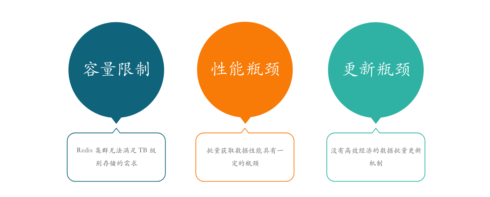

在自研 KV 存储之前，微博广告一直都是使用 Redis 作为在线存储， Redis 具有高性能、数据结构丰富等优秀的特性，在早期很好的特征模型存储需求。随着业务增长，模型越来越复杂，特征数据规模、特征个数快速增长，Redis 作为在线存储的解决方案逐渐暴露出一些瓶颈问题：

- **容量限制** 由于 Redis 是纯内存产品，无法满足 TB 级的存储需求，集群构建成本较高。
- **性能瓶颈** 使用 Redis 存储特征数据，当批量获取大量数据时延时较高，P99 高达 20ms, 无法，对于 mget 操作 Redis 在集群模式下一直支持的不够好。
- **更新瓶颈** 对于离线特征数据不仅容量大，而且单个特征数据 KV 对高达数百亿条，如果采用接口的方式更新数据，难以在例行化周期内完成高效的数据更新。

另外从运维集群角度来看，在热点流量来的几分钟内需要完成数据存储的弹性扩容，具有弹性扩容特性是在线存储的必备的特性。使用 Redis 难以实现弹性扩容，需要大量的二次开发工作。

我们针对业务使用的瓶颈与运维角度使用 Redis 过程中发现的一些短板问题，调研了目前业界开源的 KV 在线存储系统，目前通用的做法是使用 SSD 硬盘与 RocksDB 的存储满足容量上的需求，但是对于批量导入和批量获取、系统运维无论是功能还是性能都无法满足业务需求，最终我们基于 SSD 硬盘与 RocksDB 存储引擎开发设计了一套分布式 KV 存储系统。

## 使用概况

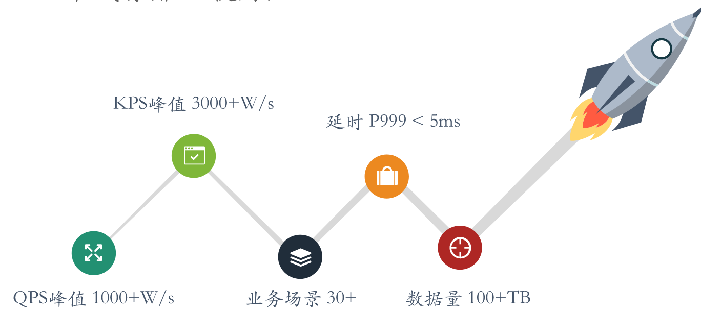

LaserDB 从 2019 年年初立项开发，年中试运行第一个项目到现在已经在微博内部有 30 多个业务场景在使用 Laser 存储数据。目前集群的 QPS 峰值高达 1000W/s, KPS (每秒处理 Key 个数) 高达 3000W/s, 大部分在线读取场景单个 get 操作 P999 小于 5ms, mget 操作 P999 小于 10ms, 整体数据量高达 200TB. 支撑整个微博广告的特征模型、样本拼接日志存储需求。

## 功能特性

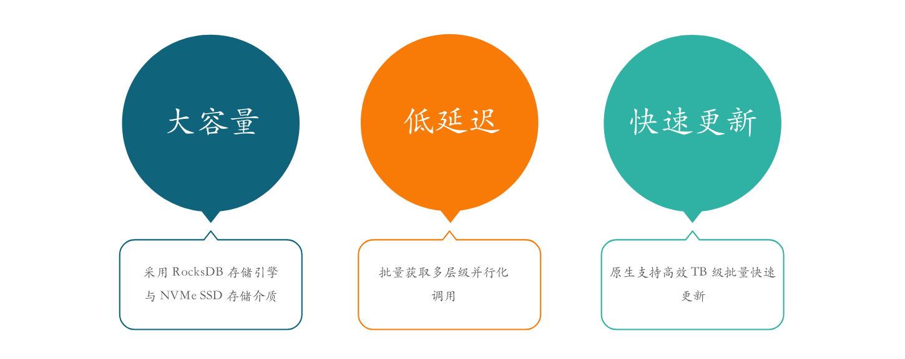

### 大容量

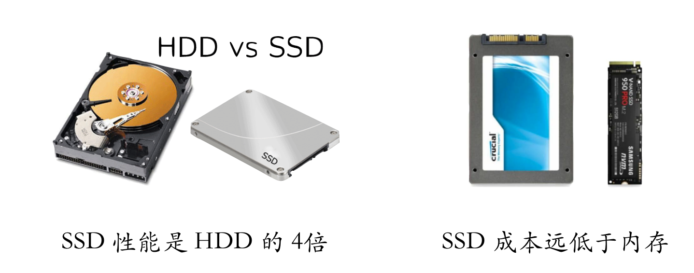

存储引擎和存储介质分别使用 RocksDB  和 ssd 解决存储容量瓶颈，解决大规模数据存储的成本问题。由于 RocksDB 内部实现机制后台会执行合并操作，会有一定的读写放大，很容易产生磁盘读写 IO 瓶颈。对于固态硬盘目前有 NVMe 固态硬盘和 SATA 固态硬盘两类，它们的主要区别在于信号协议和传输协议上。通过对比我们可以清楚的看到，NVMe 固态硬盘在性能上具有明显的优势。将 SATA SSD 替换成 NvME SSD 可以有效的解决 IO 读写瓶颈问题。

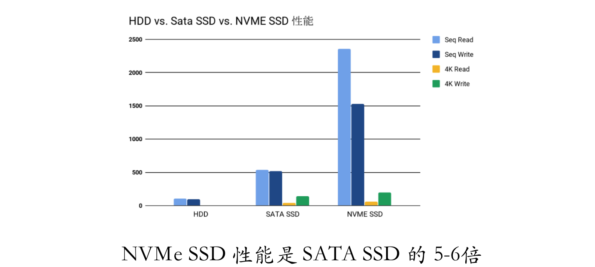

### 低延迟

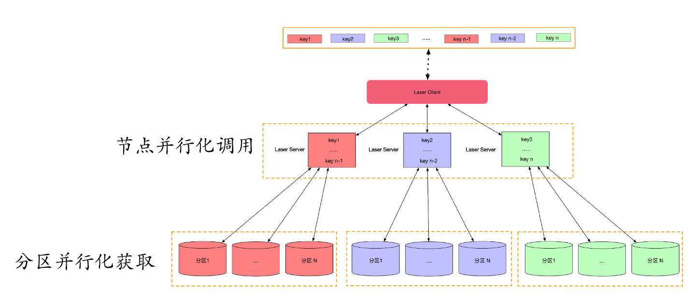

Laser 可以满足在线计算的高性能、低延迟、高吞吐业务场景, 大部分场景下单命令操作 P999 可以在 5ms 内响应。对于 mget 批量获取的场景 Laser 采用多层并行化方式实现低延迟响应，客户端层级通过对分片对应的物理节点进行并行化的请求，服务端对多个 key 所在的不同分区进行并行化获取。对于单个 RocksDB 实例分区的多个 key 利用 UringIO 特性进行并行化 IO 操作，最大限度的进行各个层级并行化, 从而满足高性能、低延迟的需求。

### 批量导入

在机器学习领域的在线预估服务需要高性能读取特征、模型的同时也需要快速的无缝的大批量的更新模型，通常离线数据更新到在线数据库中通过调用对应的 RPC 接口完成，在特征条目高达百亿级别的特征数据，使用 RPC 更新迭代周期长，并且在更新特征数据时会影响在线存储读取性能，为了更好的支持大规模离线特征数据周期性批量替换，LaserDB 原生支持快速高效批量导入功能，并且多个副本之间的数据会自动完成同步。

### 兼容 Redis

Laser 考虑到业务迁移成本，Laser 吸收了 Redis 高性能、数据结构丰富的优点，在存储层实现了 Redis 中大部分数据结构，接口层除了提供 SDK 客户端外，还提供了兼容 Redis 协议的 Proxy ，业务方可以无缝调用 Proxy 将业务由 Redis 切换到 Laser 存储。

Laser 支持 Redis 大部分数据结构与命令操作，另外针对批量获取操作通过多层级并行化调用的方式进行了深度的优化，最终使用 Laser 进行 mget 操作性能要优于 Redis, 而且随着获取 Key 数量的增加性能优势越来越大。

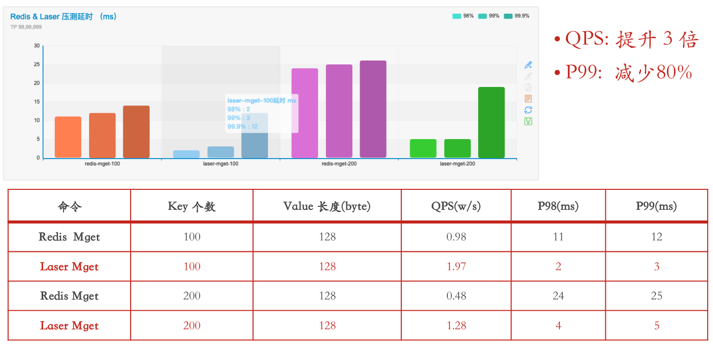

### 多租户

作为在线数据存储服务，在服务上层要对接各种应用场景的数据，如果只是简单的通过 key 空间分割业务，随着接入业务方的增加，不同业务对系统的需求不一样，有的业务 Value 很大但是对延时要求不是很高， 有的业务 Value 不是很大，但对于延时要求极其严格（P999 < 5ms）, 最终很难统一在一套集群中去运维。如果每个业务一套集群一方面增加运维成本，另一方面对应的物理资源也很难合理的利用起来。 所以 Laser 为了解决不同业务场景不同的需求，从底层就支持了多租户的设计。Laser 引入了数据库、数据表的概念，通过对不同数据库、数据表进行不同的配置来应对不同的业务场景。实现了多租户特性 Laser 就可以有针对性的在热点流量时进行弹性扩容，合理的利用资源。

### 弹性扩容

微博经常会遇到热点事件，上游无状态服务都具有弹性扩容能力， Laser 实现的批量导入、多租户特性为 Laser 一个有状态的服务实现弹性扩容的提供了可能。为了支持批量导入，Laser 的数据副本间同步支持数据全量同步，当弹性扩容时对应数据会触发全量同步，Laser 会自动化完成弹性扩容节点数据同步。另外由于多租户特性使得 Laser 拥有按需扩容的能力，根据不同业务扩容的需要进行扩容。

### 自动容灾

整个集群由固定分片的多个副本组成，每个分片有一个副本是 Leader 角色，其余的都是 Follower 角色，多个副本之间的数据同步都是从 Leader 角色的分片副本上同步数据。所以对于分片维度来说是一主多从的架构，Laser 只有 Leader 角色的分片副本才可以接收写类型的操作，Leader 角色的分片副本在整个集群其实是单点。为了避免出现单点 Laser 实现了自动容灾功能，假设某个服务节点故障，首先会判断该节点是否有 Leader 角色的分片，如果存在 Leader 分片，集群会自动将分片对应的 Follower 分片副本中同步数据最多的一个副本切换为 Leader 分片，整个过程平滑过渡，无需重启任何节点。

## 系统架构与设计

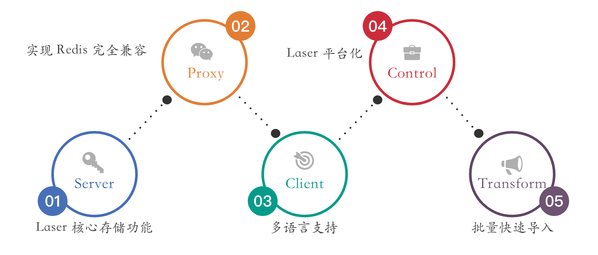

LaserDB 主要包括三大核心组件：Laser Server（存储服务）, Laser Client （客户端）和 Laser Control（管理平台）, 此外还有适配 Redis 协议的 Laser Proxy（协议代理服务） 以及满足数据批量导入的 Laser Transform （数据转化） 工具链。在具体部署时用户可以根据自己的需求选择部署 Laser Proxy 和 Laser Transform， 下图是 Laser 整个在线存储多个服务的模块架构。

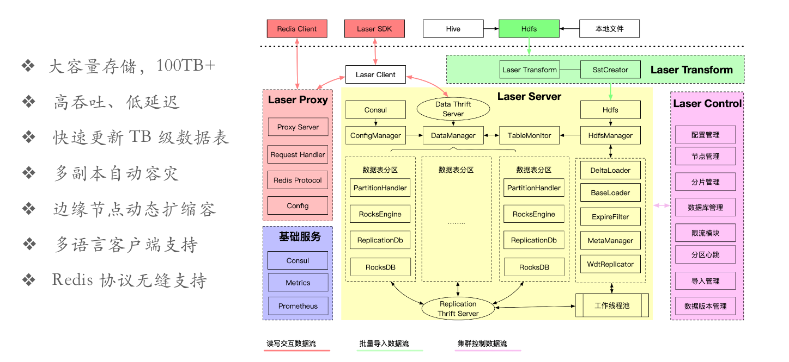

业务方可以通过 Redis Client 或者 Laser SDK 两种方式接入Laser, 对 Laser 进行读写操作，另外可以通过将数据上传到 HDFS 来完成数据的批量导入。Laser Server 主要是负责数据基础的落地，其中包括数据存储、数据同步、数据分片、数据交互的实现。Laser Proxy 主要是一个 Redis 协议代理服务，Laser 支持 Redis 协议操作的主要原因也是为了降低业务方切换使用的难度。通过 Laser Proxy 进行数据的转发，对于业务方来说可以将 Laser 集群看作是一个大的单机 Redis Server来使用。Laser Transform 主要是负责数据批量导入的合成转化工作，业务使用方使用数据批量导入功能，仅需要将数据放到 HDFS 上面，运行 Laser Transform 这个 MapReduce进行数据预处理，在预处理完成后会 Laser Server 会自动进行数据的替库操作。Laser Control 这个子服务主要是负责集群管理，比如配置热更新、分片管理、弹性扩容、自动灾备等工作。

### 数据模型

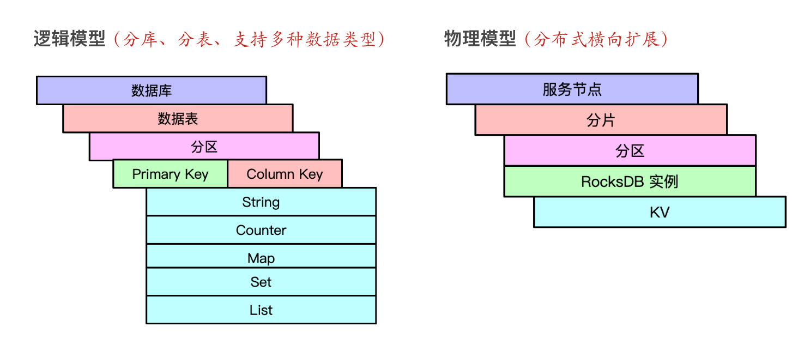

Laser 作为一个通用的 KV 存储系统，为了适应不同场景的存储需求，在逻辑存储模型设计的时候就考虑到了分库分表的功能，通过分库分表的方式针对不同的表进行不同的优化，来满足不同的业务场景，根据不同场景进行参数调优，并且根据业务进行灵活按需弹性扩容。另外借鉴了 Redis 的数据类型，Laser 也支持 String, Counter, Map, Set, List 多种数据类型，由于底层 RocksDB 仅支持 KV 字节对，Laser 在上层通过序列化以及 Key 空间局部性原理模拟实现了 Redis 的多种数据结构。为了满足 Laser 大容量存储的需求，在物理存储模型方面进行了数据分片存储，具体的物理层级分别是服务节点、分片、分区，最终的数据是存储在 RocksDB 实例中，与表分区一一对应。物理上的分片、分区可以使得 Laser 具有很好的水平扩展能力。

### 数据分片

数据分片主要是为了使集群具有水平扩展能力，对于在线存储的分片选型一般从数据是否均衡、集群变更是否会产生大量数据迁移、实现是否简单这几个纬度来考虑，Laser 为了使数据尽可能的均衡并且在集群变更时不会发生数据大量迁移，采用了多层次 Hash 的方式实现数据的分片，其本质类似于一致性 Hash。接下来通过一个例子详细说明 Laser 数据分片方式：

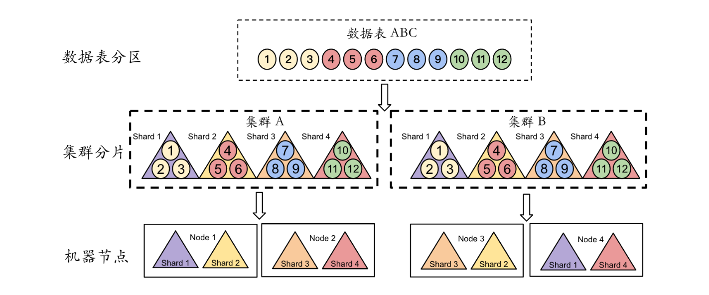

在一个有 4 个服务节点的集群中，创建一个数据库为 DatabaseA 并且有 12 个数据表分区的数据表 TableA 。假设目前集群已经创建，对应的分片与服务节点的映射关系和机器分片数已经配置完成，并且不考虑多副本容灾的情况，当前集群有 GroupA、GroupB 两个集群组，分别映射 Node1, Node2 和 Node3, Node4 四个节点,  每个集群组都是一个独立完整的副本。从图中可以看出，首先将分区一一映射到所属每个集群组的分片中，最终分片与节点以及集群组是通过静态配置来映射关系。
每个节点在启动后会周期性的将该节点所拥有的 Leader 、Follower 分片信息注册到注册中心。 当知道 ShardId 后以及要请求 Shard 的角色，即可通过服务发现的方式查找出应该交互的服务节点地址。

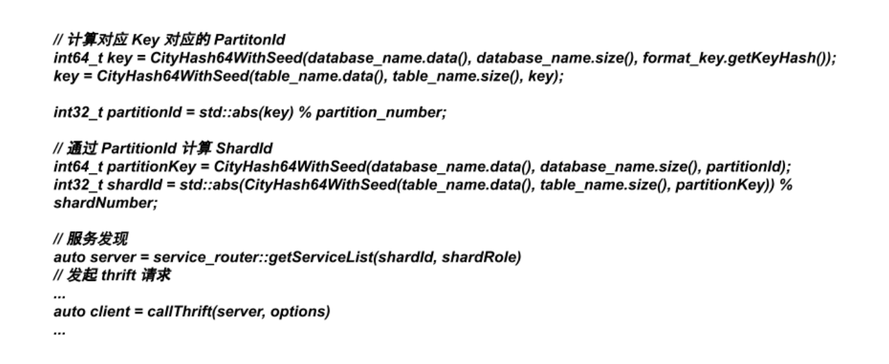

一般的数据库都是通过主从的方式实现数据的高可用，Laser 同样也是采用分片级一主多从的方式实现数据的高可用，主从角色对于 Laser 来说并不是以服务节点为单位的，而是以数据分片（Shard）单位的。 以 Shard 为主从单位的好处就是可以更加灵活的对整体集群弹性部署，在自动容灾、动态扩容、动态缩容的时候调整主从角色也更加灵活方便。不过以 Shard 为主从单位的缺点是 在分片 Shard 的时候可能会出现将一对主从分片分配到同一个服务节点的情况，如果当前服务节点故障会出现整个分片不可服务的情况，这个情况对于后续运维分配 Shard 带来挑战。
Laser 为了彻底的避免将同一个分片对应的主从两个分片分配到同一个服务节点上，在 LaserDB 设计的时候引入了集群组概念, 集群创建时规定每个集群组至少拥有整个集群的一个数据副本，在集群组与对应服务节点映射时，保证 不同的集群组映射不同的物理服务节点，每个集群有且只有一个主分片副本。每个分片可以有 Leader/Follower 两个角色选择，相同分片不同的角色直接可以实时热切换。

### 数据导入

Laser 批量导入的原理是通过离线的方式先将原始数据转化为一个 Laser Server 可以直接加载的文件，存放到 HDFS 指定的路劲下，Laser Server 端通过不断的监听 Hdfs 中文件的变化准实时的去拉取加载的文件，当将整个表对应的分区文件都拉取完成后，Laser 将新版本的分区文件进行实例加载，并通过双 Buffer 的机制完成热切换。批量导入之所以可以快速完成数据更新，主要是使用了 RocksDB 的 SST 文件格式，SST 文件是一个 Key 值有序的文件，外部将要导入的数据生成 SST 文件格式，所以 Laser Transform 的主要工作是将原始数据进行序列化并且生成有序的 SST 分区文件。

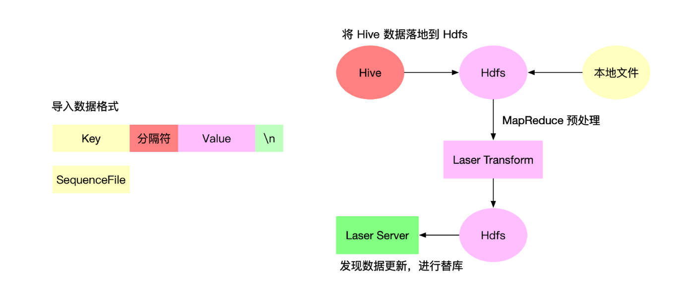

如果将一个原始的文件转化为有序的 SST 分区文件，如果采用 RocksDB 接口将无序的 Key 插入进行来完成 SST 生成，将耗费大量的 CPU 资源，由于涉及到排序合并无法快速高效的生成有序 SST 文件。Laser Transform 利用 MapReduce 分布式的方式将原始数据进行序列化并最终生成有序分区 SST，加速了大规模数据导入效率。

### 数据同步

Laser 主从同步功能，有两种同步模式，分别是全量同步和增量同步，每次都是从分片发起同步请求，当主分片收到同步请求后会根据当时的一些条件判断具体的同步模式，有两种情况会触发全量同步，第一个是当批量导入数据后分区版本发升变更，第二个是当从分片与主分片差距太大时，其余的情形默认采用增量同步。对于全量同步就是主分片将数据目录进行快照，将数据通过 WDT 这个工具传送给从分片，最终从分片进行重新加载就完成一次全量同步。对于增量同步是采用更新日志回放的原理来进行数据同步。当主分片收到同步请求后，主分片会将最近更新的日志发送给从分片,从分片对日志进行回放来完成增量同步。

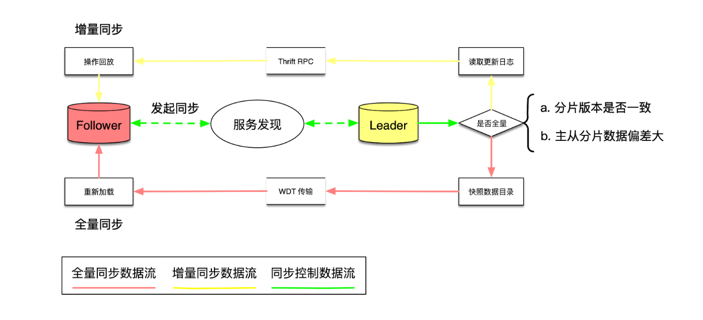

### 弹性扩容

在分布式系统服务节点弹性扩容缩容是比较常见的运维操作需求，通常对于在线存储由于扩缩容会涉及到数据迁移，Laser 通过以分片为单位的方式进行集群的变更，由于 Laser 中分片有 Leader、Follower 两种角色，对于任何集群变更只允许从 Follower 角色的分片进行调整，如果调整 Leader 分片需要通过角色切换的方式转化为 Follower。所有的分片调整数据迁移都是通过 Laser 的全量同步机制自动触发并自动完成的，无需人为干预。

Laser 一般性的集群扩容缩容操作，操作的单位是数据分片，Laser 一个分片中会服务多张数据表的多个分区。由于在微博的场景下经常性的会出现热点流量，如果 Laser 对整个集群进行扩容一方面需要迁移整个分片的数据周期较长，另一方面由于是分片粒度的，无法精准针对某个业务的某些表进行精准扩容。例如存储特征数据的表和存储特征日志的表同属于一个分片，当热点流量来临时原则上要优先扩容特征数据的表，保证在线服务的可用性。离线特征日志表通过消息队列可以做到削峰的目的，无需机器扩容。所以需要另外一种机制来满足按需弹性扩容的需求。

Laser 为服务节点引入了一个角色概念，通常分为普通节点、边缘节点。当 Laser Server 节点是普通节点则会正常数据分片，节点对应的数据分片会服务所有的数据表，如果 Laser Server 节点是边缘节点类型，则当前服务节点所配置的数据分片中仅仅服务配置的指定数据表，并且数据同步也仅同步指定数据表的数据。值得注意的是，Laser 边缘节点只是作为弹性扩容的一直解决方案，普通节点始终会维持副本的合法性。

如图，比如有 TableA, TableB 两个表，在主集群中的普通节点上数据分别分布在 1，5， 8 以及 1，3，7 号分片上。如果按需扩容这两个表仅需要动态创建两个边缘节点，分别配置上所在的分片信息，并且指定对应的表，此时在边缘节点1 上的 1，5，8号分片只有 TableA 的数据，其他表的数据只有在主集群的普通节点中拥有。客户端在请求 TableA 表中数据时会根据当时服务的节点信息自动路由到边缘节点。当流量峰值过去后可以直接关闭边缘节点，流量会自动回流到主集群。上述操作仅需要在 Laser Control 进行规则性的配置，当流量有峰值热点时系统会自动计算冗余度进行自动弹性扩容。

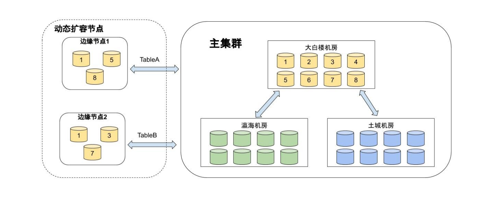

## 应用案例分析

目前 Laser 在微博主要的应用场景是存储离线特征数据、实时特征数据、日志类数据、数据缓存。对于离线特征数据一般数据源都是 HDFS 或者 Hive,  通常按照天级、小时级进行例行化更新，通过 Laser 批量导入机制完成更新，在线服务读取一般是只读模式进行。实时特征数据和离线特征日志场景基本一致，唯一的区别是在大量读取的过程中会有少量写操作。日志类数据在微博广告的主要场景是做一些样本拼接操作，此类应用一般对延时要求不高，但是会耗费大量的磁盘 IO 资源。

### 特征数据存储

特征存储有离线特征与实时特征，离线特征一般都是按照天级、小时级例行化的全量更新数据，数据源一般是 HDFS 文件或者 Hive 数据表，通过使用 Laser Transform 可以将离线特征数据快速的导入到 LaserDB 中，Transform 内部过程主要做 KV 序列化与排序，通常对于 1TB （300亿）的特征数据只需要一小时就可以完成数据的全量替换，并且在替换过程中不影响数据读操作的可用性。对于实时特征数据通常是从 Flink 流式处理引擎中调用 Laser SDK 进行实时的插入。

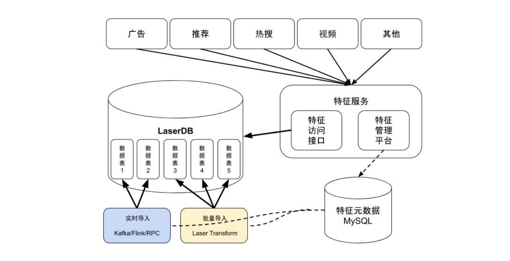

### 向量存储

LaserDB 也被用于存储大规模机器学习模型中的参数。在诸如搜索、推荐和广告等互联网业务中，许多机器学习模型里都包含了海量的稀疏特征，这些特征通常都会被映射到模型的嵌入向量（ Embedding ）上。由此可见，嵌入向量占据了模型的主要部分，它在不少场景下可以高达 TB 级别，因此我们采用了 LaserDB 来存储这部分模型参数。在响应模型的在线预测请求时，预估服务会首先从 LaserDB 中拉取请求所需的嵌入向量，然后再利用本地的推理引擎进行模型计算。

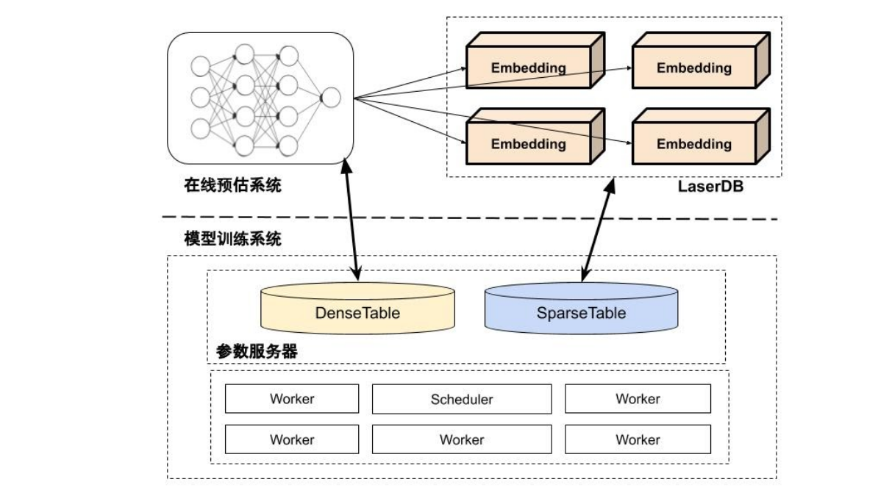

### 样本拼接

对于点击预估和转化预估等常见的监督学习建模任务而言，完整的训练样本需要包含线上服务落盘的特征快照数据，以及用户的行为反馈数据。如图 5-36 所示，LaserDB 为这套样本拼接系统中的特征快照提供了存储服务，整个样本拼接运转流程有如下整个几个核心步骤。

在线服务在完成了点击预估后会将请求标识和特征快照落盘到 LaserDB 中。样本拼接系统会实时地消费用户行为消息队列，然后它会依据请求标识来从 LaserDB 中拉取对应的特征快照数据，并最终生成完整的训练样本。样本拼接系统会利用 LaserDB 的数据淘汰功能来删除过期的特征快照数据。

一般情况下，对于拼接系统对数据读延时要求不是很高，但是会产生大量的 IO 操作，所以为了更合理的利用物理资源，Laser 拥有 IO 流控机制，对于此类数据表一般都会在流量高峰期限制 RocksDB 合并操作的速度，待流量低谷期时再进行集中合并操作，从而合理的利用 CPU / IO 资源。

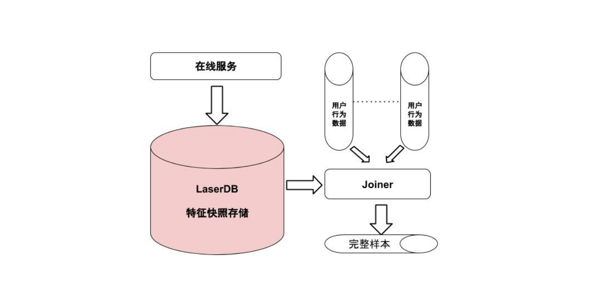
