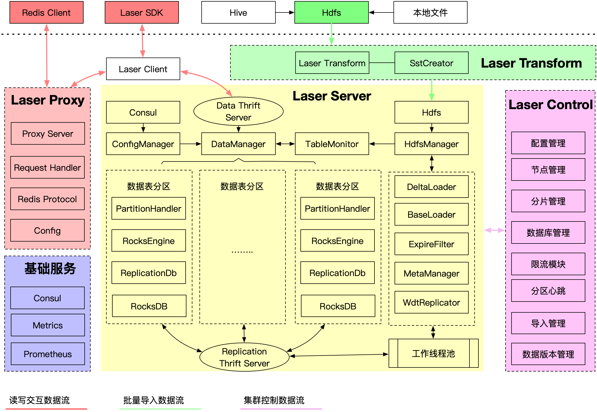

LaserDB 是微博设计开源的高性能分布式 KV 数据库，在满足传统 KV 存储的高性能的基础上，提供了大容量分布式存储解决方案。
并且为了满足大数据、人工智能特征模型快速加载更新，LaserDB 原生支持了快速批量、增量导入功能，LaserDB 不仅可以满足一般
的工程业务应用，并且很好的支撑了机器学习模型、特征数据存储需求。

特点
----

- **高性能:** 满足在线计算的高性能、低延迟、高吞吐业务场景, 大部分场景下 P999 可以在 3ms 内响应, 并且提供高效的并行获取接口 
- **快速导入:** 对于机器学习领域需要在线预估服务需要高性能读取特征、模型的同时也需要快速的无缝的大批量的更新模型，LaserDB 可以快速的完成大量数据的批量导入
- **水平扩展:** LaserDB 通过数据分片的方式来支持整个集群的水平扩展，并且通过支持数据同步来提升系统的可用性，降低运维难度
- **动态扩容缩容:** 通过完整的运维控制面板可以快速的完成集群的扩容缩容操作, 提升运维体验
- **自动容灾:** 在集群内节点发生故障时，可以自动的进行容灾切换
- **批量获取:** 对于 KV 存储一般有批量获取的需求，以降低业务的响应时间，LaserDB 在 client 层与 server 层进行了两层并行化调用尽可能的降低了批量获取的响应时间
- **兼容 Redis 协议:** 由于目前应用比较广泛的 KV 存储是 redis, 为了降低用户切换 LaserDB 的成本，LaserDB 提供了 Redis 协议兼容的解决方案，对于大部分业务可以无缝切换 LaserDB

LaserDB 整体架构
---------------

深入了解 LaserDB 的整体架构可以更好的使用、运维 LaserDB, LaserDB 主要包括三大核心组件：Laser Server, Laser Client 和 Laser Control, 此外还有适配 Redis 协议的 Laser Proxy 
以及满足数据批量导入的 Laser Transform。在具体部署时用户可以根据自己的需求选择部署 Laser Proxy 和 Laser Transform

### Laser Server

LaserDB 的存储服务核心组件，负责接收 thrift 请求并且处理对应的请求。除了负责对外的服务请求处理以外，还负责具体的数据存储、数据分片、数据同步等功能

### Laser Control

负责集群数据表、数据表配置以及集群分片信息的管理，提供分片可视化、动态扩容、动态缩容

### Laser Client

主要是负责和 Server 进行接口交互，并且实现 LaserDB 整体请求路由机制，对 Server 端提供的 API 接口进行封装，实现 mget, mset 等批量操作的客户端层并行化, 目前提供 C++, Golang 版本的 SDK 可以直接
与 Laser server 交互获得更好的性能，其他语言的业务可以选择 Laser Proxy 代理，最终通过 redis 客户端操作

### Laser Proxy

Laser Proxy 主要是负责实现 Redis 协议的大部分常用命令支持，Proxy 通过调用 Laser Client 与 Laser Server 交互，对于 Proxy 来说是一个完全无状态的服务，可以将 Proxy 当做一个存储容量特别大的 Redis server 来看
。对于原有业务是 Redis 的，获取不方便直接使用 Laser Client SDK 调用的业务场景可以选用 Laser Proxy

### Laser Transform

Laser Transform 主要是负责实现数据的批量导入功能，对于有数据快速批量导入的需求，需要部署 Laser Transform 服务，并且 Laser Server 环境需要有 hdfs 客户端支持，Transform 服务主要负责定时调度提交 MapReduce 
任务，将原始格式的数据转化为 Laser Server 可以识别的数据
