## 机器环境初始化

### 中控机

- 安装 ansible，以 centos 为例:

  ```shell
  yum install ansible
  ```

- 使用 ssh-keygen 生成公私钥对，默认生成到 ~/.ssh 目录。

### 目标机器（服务运行的机器）

- 服务器需要创建 adbot 用户，并以 adbot 用户运行 sshd 服务，监听 30022 端口，authorized_keys 文件中添加中控机生成的秘钥对中的公钥 id_rsa.pub。

  我们提供了快捷配置脚本，使用如下：

  ```shell
  git clone laser-control
  cd laser-control/deploy
  vim ansible_install_agent.sh # 将其中的 SSH_PUBLIC_KEY 替换成中控机中生成的秘钥对中的公钥 id_rsa.pub
  sh ansible_install_agent.sh
  ```
  
  :::caution 注意
  此快捷配置脚本仅支持 CentOS 7
  :::

- 创建软链 /usr/local/adbot 链接到数据磁盘目录。

### 环境测试

在中控机上运行如下命令：

```shell
sudo su adbot
ssh 目标机器IP -p 30022
```

测试是否能够登陆到目标机器，如果登陆成功，则说明环境配置正确。


## Consul ServiceName 创建

在 consul 上创建两个服务名 laser_demo 和 laser_demo_replication


## Laser Batch Update Manager 部署

### 配置 laser_batch_update_manager_demo.yml

laser_batch_update_manager_demo.yml 配置项如下：

| 变量                       | 说明                                                       |
| -------------------------- | ---------------------------------------------------------- |
| package_tag                | laser batch update manager 版本，如 v1.0.1                 |
| package_name               | 包名，默认 laser_batch_update_manager                      |
| instance_name              | 实例名                                                     |
| start_options              | 启动参数                                                   |
| ad_core_user               | 进程运行的用户                                             |
| ad_core_group              | 进程运行的组                                               |
| http_port                  | 服务监听的端口号                                           |
| hdfs_base_path             | laser 集群批量导入使用的 hdfs 路径                         |
| hdfs_sub_path              | laser hdfs 子目录，这里是 demo 环境，所以子目录为 demo     |
| hdfs_import_type           | 批量导入类型：base - 全量导入，delta - 增量导入，默认 base |
| hdfs_hadoop_config_path    | hadoop、hdfs 配置文件路径                                  |
| laser_monitor_task_cron    | 扫描 laser 数据版本信息的定时任务配置                      |
| laser_dingding_task_cron   | 发送钉钉消息定时任务配置                                   |
| checksum_monitor_task_cron | 获取 laser 数据版本信息的 checksum 定时任务配置            |
| dingding_enable            | false                                                      |
| dingding_secret            | 通过 webhook 发送钉钉消息所使用的的秘钥                    |
| dingding_token             | 通过 webhook 发送钉钉消息所使用的的token                   |

:::info
laser_batch_update_manager_demo.yml 是一个 ansbile playbook 文件，具体语法请参考 ansible playbook
:::

### 配置 hosts 文件

在 hosts 文件的 [laser_batch_update_manager_demo] 节下配置 batch update manager 所要部署的机器，

例如 10.11.11.10


### 执行部署操作

```shell
cd deploy
sudo su adbot
ansible-playbook -i hosts laser_batch_update_manager_demo.yml --tags upgrade # tags 参数：upgrade-部署更新, start-启动，stop-停止，restart-重启
```


## Laser Control 部署

### 配置 config.yml 文件

config.yml 中需要修改的配置项如下：

| 配置项                             | 说明                                                    |
| ---------------------------------- | ------------------------------------------------------- |
| consul:address                     | consul 地址（如：10.1.2.3:12345）                       |
| consul:token                       | consul token                                            |
| cluster:serviceName                | 例如您的集群服务名是 laser_demo，那么这里填写 demo 即可 |
| cluster:proxyServiceName           | 与 serviceName 相同即可                                 |
| batchUpdateManager:url             | batch update manager 服务的url，格式：http://host:port  |
| ansible:sshPort                    | 服务运行的机器 sshd 服务监听的端口                      |
| email:emailUser                    | 您的邮件服务用户名                                      |
| email:emailPassword                | 您的邮件服务密码                                        |
| email:emailSnmpAddress             | smtp 服务地址，格式： host:port                         |
| email:emailFrom                    | 发件地址                                                |
| prometheus:serverPrometheusAddress | 获取 laser server 运行指标的地址，格式：host:port       |
| prometheus:clientPrometheusAddress | 获取 laser server 机器物理指标的地址，格式：host:port   |

开发环境中的 config/config.yml 和部署脚本中的 deploy/roles/laser_control/templates/config.yml 都需要按照上面的说明修改相应配置。 deploy/roles/laser_control/templates/config.yml 中 "{{xxxxx}}" ansible 变量的声明在 deploy/laser_demon_control.yml 中，所以如果需要对这些 ansible 变量的值进行修改，则直接在 deploy/laser_demo_control.yml 修改即可。


### 配置 laser_demo_control.yml 

| 变量          | 说明                                            |
| ------------- | ----------------------------------------------- |
| package_tag   | laser control 版本                              |
| package_name  | 包名，默认  laser_control                       |
| instance_name | laser control 部署的实例名，laser_demon_control |
| start_options | 启动参数                                        |

其他参数参考 config.yml 配置文件


### 配置hosts文件

在 deploy/hosts 文件中 [laser_demo_control] 节填入 laser control 要部署的机器IP

### 执行部署操作

```shell
sudo su adbot
cd deploy
ansible-playbook -i hosts laser_demo_control.yml --tags upgrade
```


## Laser 集群配置部署

### 登录 laser control

登录 laser control，地址：http://host:port 

host 为 laser control 部署的机器地址，port 为 config.yml 配置文件中的 http:port

### 创建集群

在【集群管理】- 【集群管理】中添加一个示例集群 demo（与 config.yml 文件中的 serviceName 一致）:

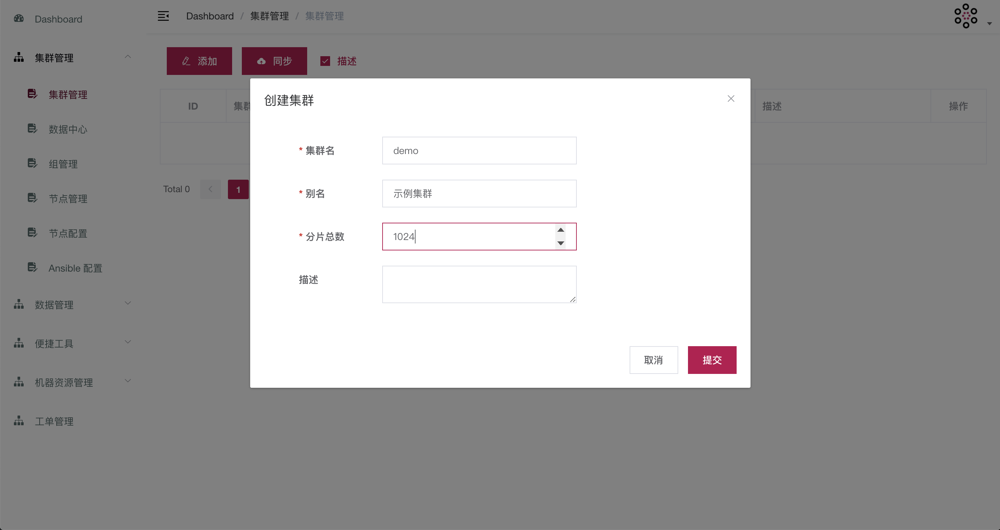


### 创建数据中心

在【集群管理】-【数据中心】中创建一个默认的数据中心 default:

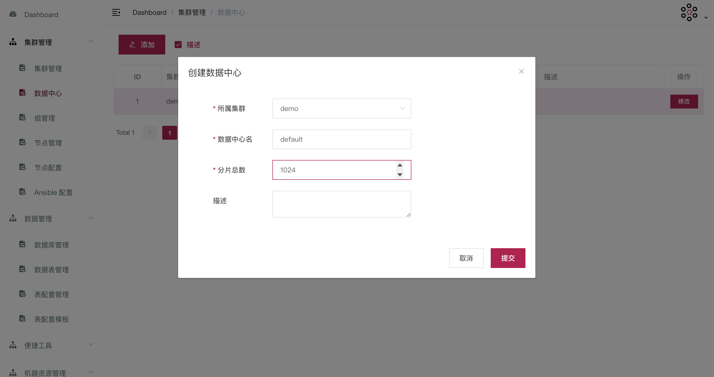


### 创建节点配置

在【集群管理】-【节点配置】中增加一个默认的节点配置 default:

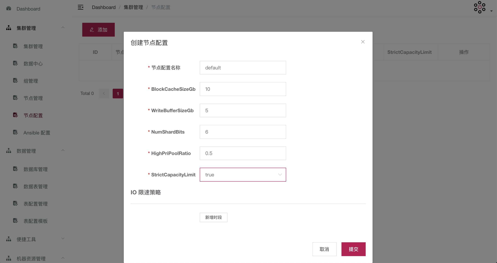


### 创建组

在【集群管理】-【组管理】中添加两个组 group_master 和 group_follower：

group_master:

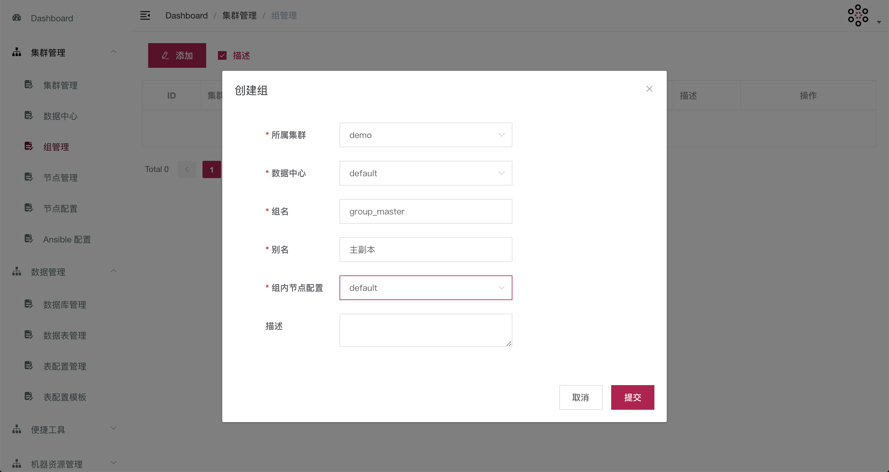


group_follower:

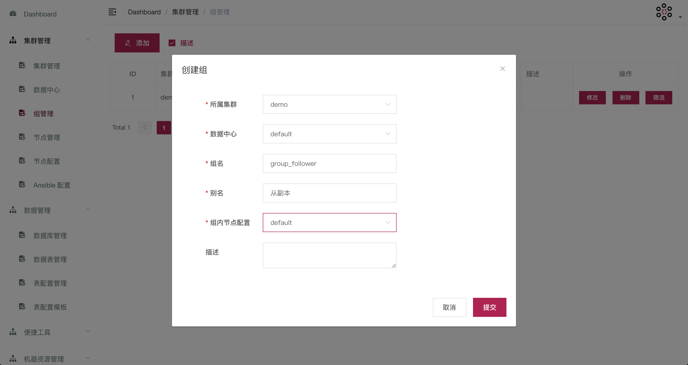


### 添加机器分类

在【机器资源管理】-【机器资源分类】中添加一个机器分类 TestMachines:

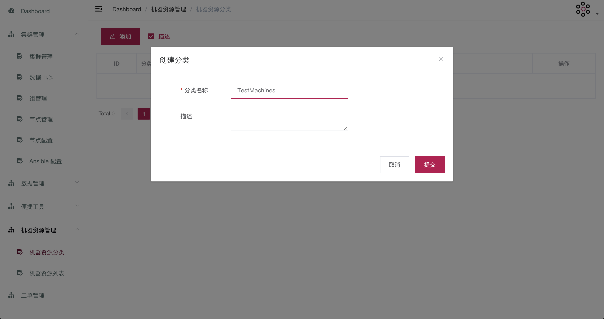


### 添加机器资源

在【机器资源管理】-【机器资源列表】中添加两个机器（10.11.11.11、10.11.11.12）实际配置时请替换成有效的IP地址：

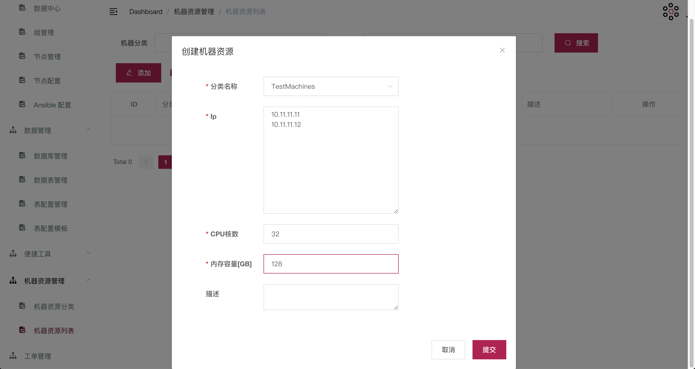


### 添加节点启动配置

在【集群管理】-【Ansible 配置】中添加节点启动配置 laser_start_option:

| 名称                       | 值                                                           | 备注                                                         |
| -------------------------- | ------------------------------------------------------------ | ------------------------------------------------------------ |
| laser_start_option         |                                                              |                                                              |
| **Roles 配置**             |                                                              |                                                              |
| service,laser_data_cleaner |                                                              | :warning: 如果是边缘节点，使用 ramdisk,service,laser_data_cleaner |
| **Vars 配置**              |                                                              |                                                              |
| package_tag                | v1.0.1                                                       | laser server  编译的二进制包版本号                           |
| package_name               | laserdb                                                      | 包名                                                         |
| service_name               | laser_demo                                                   | 服务名                                                       |
| replication_service_name   | laser_demo_replication                                       | 主从同步服务名                                               |
| http_port                  | 10030                                                        | http 端口                                                    |
| thrift_port                | 20030                                                        | thrift 端口                                                  |
| replicator_port            | 30030                                                        | 主从同步端口                                                 |
| consul_addresses           | 10.11.11.20:8500                                             | consul 地址                                                  |
| hdfs_check_url             | http://10.11.11.10:8080/checksum                             | 版本检查服务端口                                             |
| hdfs_data_dir              | /dw_ext/ad/ads_core/laser/demo                               | hdfs 数据目录                                                |
| start_options              | -hadoop_path=/usr/local/hadoop-2.7.3/bin/hadoop --service-name={{service_name}} --router_consul_addresses={{consul_addresses}} --http-port={{http_port}} --port={{thrift_port}} --replicator_port={{replicator_port}} -data_dir=/usr/local/adbot/{{instance_name}}/data -hdfs_monitor_interval=30000 --call_hdfs_metadata_flag=true --call_hdfs_metadata_url={{hdfs_check_url}} --group-name={{group_name}} --node-id={{node_id}} --dc={{dc}} -laser_hdfs_data_dir={{hdfs_data_dir}}  -vmodule='hdfsmonitor=0,partition_handler=0,replication_db=0' --replicator_max_updates_per_response=500 -replicator_service_name={{replication_service_name}} -wdt_global_receiver_limit=50 -loader_thread_nums=16 -wdt_replicator_abort_timeout_ms=6000000 -wdt_overwrite=true -wdt_ipv4=true -wdt_encryption_type=none -wdt_accept_timeout_millis=30000 -wdt_accept_window_millis=20000 -wdt_connect_timeout_millis=10000 -idle_timeout=86400000 -http_server_work_thread_num=16 -wdt_max_mbytes_per_sec=400 --replication_reverse_mode_enable=false --delay_set_available_seconds=1 | 启动参数                                                     |
| instance_name              | laser_demo_server                                            | 实例名                                                       |
| other_env                  | JAVA_HOME="/usr/local/jdk1.8.0_131"                          | 其他环境变量                                                 |
| clean_hour                 | */1                                                          |                                                              |
| clean_minute               | 20                                                           |                                                              |
| ramdisk_size               | 96G                                                          | :warning:  :warning: :warning: 仅边缘节点或者内存池使用，普通节点无需增加此配置项	​​ |


### 添加节点

在【集群管理】-【节点管理】-【主副本】中添加一个主节点，配置如下：

| 配置名称    | 配置值  |
| ---------- | ------------------------------------------------------------ |
| 所属组     | group_master                                                 |
| 节点Id     | 1                                                            |
| 地址       | 10.11.11.11 (请替换成有效的IP地址)                           |
| 端口       | 10030                                                        |
| 配置       | default                                                      |
| 启动配置   | laser_start_option                                           |
| 主节点     | 是                                                           |
| 边缘节点   | 否                                                           |
| 激活       | 是                                                           |
| 主分片列表 | 0, 1, 2, 3, 4, 5, 6, 7, 8, 9, 10, 11, 12, 13, 14, 15, 16, 17, 18, 19, 20, 21, 22, 23, 24, 25, 26, 27, 28, 29, 30, 31, 32, 33, 34, 35, 36, 37, 38, 39, 40, 41, 42, 43, 44, 45, 46, 47, 48, 49, 50, 51, 52, 53, 54, 55, 56, 57, 58, 59, 60, 61, 62, 63, 64, 65, 66, 67, 68, 69, 70, 71, 72, 73, 74, 75, 76, 77, 78, 79, 80, 81, 82, 83, 84, 85, 86, 87, 88, 89, 90, 91, 92, 93, 94, 95, 96, 97, 98, 99, 100, 101, 102, 103, 104, 105, 106, 107, 108, 109, 110, 111, 112, 113, 114, 115, 116, 117, 118, 119, 120, 121, 122, 123, 124, 125, 126, 127, 128, 129, 130, 131, 132, 133, 134, 135, 136, 137, 138, 139, 140, 141, 142, 143, 144, 145, 146, 147, 148, 149, 150, 151, 152, 153, 154, 155, 156, 157, 158, 159, 160, 161, 162, 163, 164, 165, 166, 167, 168, 169, 170, 171, 172, 173, 174, 175, 176, 177, 178, 179, 180, 181, 182, 183, 184, 185, 186, 187, 188, 189, 190, 191, 192, 193, 194, 195, 196, 197, 198, 199, 200, 201, 202, 203, 204, 205, 206, 207, 208, 209, 210, 211, 212, 213, 214, 215, 216, 217, 218, 219, 220, 221, 222, 223, 224, 225, 226, 227, 228, 229, 230, 231, 232, 233, 234, 235, 236, 237, 238, 239, 240, 241, 242, 243, 244, 245, 246, 247, 248, 249, 250, 251, 252, 253, 254, 255, 256, 257, 258, 259, 260, 261, 262, 263, 264, 265, 266, 267, 268, 269, 270, 271, 272, 273, 274, 275, 276, 277, 278, 279, 280, 281, 282, 283, 284, 285, 286, 287, 288, 289, 290, 291, 292, 293, 294, 295, 296, 297, 298, 299, 300, 301, 302, 303, 304, 305, 306, 307, 308, 309, 310, 311, 312, 313, 314, 315, 316, 317, 318, 319, 320, 321, 322, 323, 324, 325, 326, 327, 328, 329, 330, 331, 332, 333, 334, 335, 336, 337, 338, 339, 340, 341, 342, 343, 344, 345, 346, 347, 348, 349, 350, 351, 352, 353, 354, 355, 356, 357, 358, 359, 360, 361, 362, 363, 364, 365, 366, 367, 368, 369, 370, 371, 372, 373, 374, 375, 376, 377, 378, 379, 380, 381, 382, 383, 384, 385, 386, 387, 388, 389, 390, 391, 392, 393, 394, 395, 396, 397, 398, 399, 400, 401, 402, 403, 404, 405, 406, 407, 408, 409, 410, 411, 412, 413, 414, 415, 416, 417, 418, 419, 420, 421, 422, 423, 424, 425, 426, 427, 428, 429, 430, 431, 432, 433, 434, 435, 436, 437, 438, 439, 440, 441, 442, 443, 444, 445, 446, 447, 448, 449, 450, 451, 452, 453, 454, 455, 456, 457, 458, 459, 460, 461, 462, 463, 464, 465, 466, 467, 468, 469, 470, 471, 472, 473, 474, 475, 476, 477, 478, 479, 480, 481, 482, 483, 484, 485, 486, 487, 488, 489, 490, 491, 492, 493, 494, 495, 496, 497, 498, 499, 500, 501, 502, 503, 504, 505, 506, 507, 508, 509, 510, 511, 512, 513, 514, 515, 516, 517, 518, 519, 520, 521, 522, 523, 524, 525, 526, 527, 528, 529, 530, 531, 532, 533, 534, 535, 536, 537, 538, 539, 540, 541, 542, 543, 544, 545, 546, 547, 548, 549, 550, 551, 552, 553, 554, 555, 556, 557, 558, 559, 560, 561, 562, 563, 564, 565, 566, 567, 568, 569, 570, 571, 572, 573, 574, 575, 576, 577, 578, 579, 580, 581, 582, 583, 584, 585, 586, 587, 588, 589, 590, 591, 592, 593, 594, 595, 596, 597, 598, 599, 600, 601, 602, 603, 604, 605, 606, 607, 608, 609, 610, 611, 612, 613, 614, 615, 616, 617, 618, 619, 620, 621, 622, 623, 624, 625, 626, 627, 628, 629, 630, 631, 632, 633, 634, 635, 636, 637, 638, 639, 640, 641, 642, 643, 644, 645, 646, 647, 648, 649, 650, 651, 652, 653, 654, 655, 656, 657, 658, 659, 660, 661, 662, 663, 664, 665, 666, 667, 668, 669, 670, 671, 672, 673, 674, 675, 676, 677, 678, 679, 680, 681, 682, 683, 684, 685, 686, 687, 688, 689, 690, 691, 692, 693, 694, 695, 696, 697, 698, 699, 700, 701, 702, 703, 704, 705, 706, 707, 708, 709, 710, 711, 712, 713, 714, 715, 716, 717, 718, 719, 720, 721, 722, 723, 724, 725, 726, 727, 728, 729, 730, 731, 732, 733, 734, 735, 736, 737, 738, 739, 740, 741, 742, 743, 744, 745, 746, 747, 748, 749, 750, 751, 752, 753, 754, 755, 756, 757, 758, 759, 760, 761, 762, 763, 764, 765, 766, 767, 768, 769, 770, 771, 772, 773, 774, 775, 776, 777, 778, 779, 780, 781, 782, 783, 784, 785, 786, 787, 788, 789, 790, 791, 792, 793, 794, 795, 796, 797, 798, 799, 800, 801, 802, 803, 804, 805, 806, 807, 808, 809, 810, 811, 812, 813, 814, 815, 816, 817, 818, 819, 820, 821, 822, 823, 824, 825, 826, 827, 828, 829, 830, 831, 832, 833, 834, 835, 836, 837, 838, 839, 840, 841, 842, 843, 844, 845, 846, 847, 848, 849, 850, 851, 852, 853, 854, 855, 856, 857, 858, 859, 860, 861, 862, 863, 864, 865, 866, 867, 868, 869, 870, 871, 872, 873, 874, 875, 876, 877, 878, 879, 880, 881, 882, 883, 884, 885, 886, 887, 888, 889, 890, 891, 892, 893, 894, 895, 896, 897, 898, 899, 900, 901, 902, 903, 904, 905, 906, 907, 908, 909, 910, 911, 912, 913, 914, 915, 916, 917, 918, 919, 920, 921, 922, 923, 924, 925, 926, 927, 928, 929, 930, 931, 932, 933, 934, 935, 936, 937, 938, 939, 940, 941, 942, 943, 944, 945, 946, 947, 948, 949, 950, 951, 952, 953, 954, 955, 956, 957, 958, 959, 960, 961, 962, 963, 964, 965, 966, 967, 968, 969, 970, 971, 972, 973, 974, 975, 976, 977, 978, 979, 980, 981, 982, 983, 984, 985, 986, 987, 988, 989, 990, 991, 992, 993, 994, 995, 996, 997, 998, 999, 1000, 1001, 1002, 1003, 1004, 1005, 1006, 1007, 1008, 1009, 1010, 1011, 1012, 1013, 1014, 1015, 1016, 1017, 1018, 1019, 1020, 1021, 1022, 1023 |

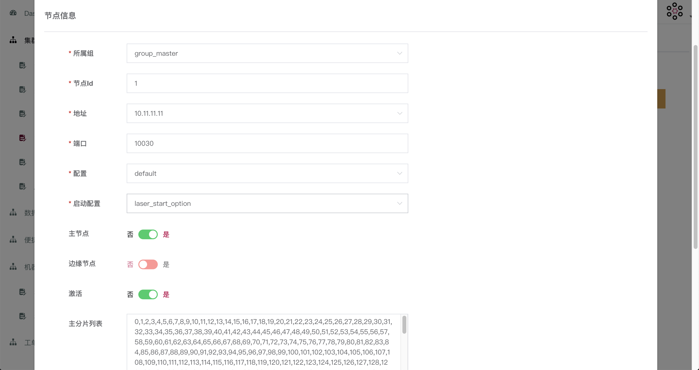


在【集群管理】-【节点管理】-【从副本】中添加一个从节点，配置如下：

|配置名称    | 配置值      |
| ---------- | :----------------------------------------------------------- |
| 所属组     | group_follower                                               |
| 节点Id     | 1                                                            |
| 地址       | 10.11.11.12 (请替换成有效的IP地址)                           |
| 端口       | 10030                                                        |
| 配置       | default                                                      |
| 启动配置   | laser_start_option                                           |
| 主节点     | 否                                                           |
| 边缘节点   | 否                                                           |
| 激活       | 是                                                           |
| 从分片列表 | 0, 1, 2, 3, 4, 5, 6, 7, 8, 9, 10, 11, 12, 13, 14, 15, 16, 17, 18, 19, 20, 21, 22, 23, 24, 25, 26, 27, 28, 29, 30, 31, 32, 33, 34, 35, 36, 37, 38, 39, 40, 41, 42, 43, 44, 45, 46, 47, 48, 49, 50, 51, 52, 53, 54, 55, 56, 57, 58, 59, 60, 61, 62, 63, 64, 65, 66, 67, 68, 69, 70, 71, 72, 73, 74, 75, 76, 77, 78, 79, 80, 81, 82, 83, 84, 85, 86, 87, 88, 89, 90, 91, 92, 93, 94, 95, 96, 97, 98, 99, 100, 101, 102, 103, 104, 105, 106, 107, 108, 109, 110, 111, 112, 113, 114, 115, 116, 117, 118, 119, 120, 121, 122, 123, 124, 125, 126, 127, 128, 129, 130, 131, 132, 133, 134, 135, 136, 137, 138, 139, 140, 141, 142, 143, 144, 145, 146, 147, 148, 149, 150, 151, 152, 153, 154, 155, 156, 157, 158, 159, 160, 161, 162, 163, 164, 165, 166, 167, 168, 169, 170, 171, 172, 173, 174, 175, 176, 177, 178, 179, 180, 181, 182, 183, 184, 185, 186, 187, 188, 189, 190, 191, 192, 193, 194, 195, 196, 197, 198, 199, 200, 201, 202, 203, 204, 205, 206, 207, 208, 209, 210, 211, 212, 213, 214, 215, 216, 217, 218, 219, 220, 221, 222, 223, 224, 225, 226, 227, 228, 229, 230, 231, 232, 233, 234, 235, 236, 237, 238, 239, 240, 241, 242, 243, 244, 245, 246, 247, 248, 249, 250, 251, 252, 253, 254, 255, 256, 257, 258, 259, 260, 261, 262, 263, 264, 265, 266, 267, 268, 269, 270, 271, 272, 273, 274, 275, 276, 277, 278, 279, 280, 281, 282, 283, 284, 285, 286, 287, 288, 289, 290, 291, 292, 293, 294, 295, 296, 297, 298, 299, 300, 301, 302, 303, 304, 305, 306, 307, 308, 309, 310, 311, 312, 313, 314, 315, 316, 317, 318, 319, 320, 321, 322, 323, 324, 325, 326, 327, 328, 329, 330, 331, 332, 333, 334, 335, 336, 337, 338, 339, 340, 341, 342, 343, 344, 345, 346, 347, 348, 349, 350, 351, 352, 353, 354, 355, 356, 357, 358, 359, 360, 361, 362, 363, 364, 365, 366, 367, 368, 369, 370, 371, 372, 373, 374, 375, 376, 377, 378, 379, 380, 381, 382, 383, 384, 385, 386, 387, 388, 389, 390, 391, 392, 393, 394, 395, 396, 397, 398, 399, 400, 401, 402, 403, 404, 405, 406, 407, 408, 409, 410, 411, 412, 413, 414, 415, 416, 417, 418, 419, 420, 421, 422, 423, 424, 425, 426, 427, 428, 429, 430, 431, 432, 433, 434, 435, 436, 437, 438, 439, 440, 441, 442, 443, 444, 445, 446, 447, 448, 449, 450, 451, 452, 453, 454, 455, 456, 457, 458, 459, 460, 461, 462, 463, 464, 465, 466, 467, 468, 469, 470, 471, 472, 473, 474, 475, 476, 477, 478, 479, 480, 481, 482, 483, 484, 485, 486, 487, 488, 489, 490, 491, 492, 493, 494, 495, 496, 497, 498, 499, 500, 501, 502, 503, 504, 505, 506, 507, 508, 509, 510, 511, 512, 513, 514, 515, 516, 517, 518, 519, 520, 521, 522, 523, 524, 525, 526, 527, 528, 529, 530, 531, 532, 533, 534, 535, 536, 537, 538, 539, 540, 541, 542, 543, 544, 545, 546, 547, 548, 549, 550, 551, 552, 553, 554, 555, 556, 557, 558, 559, 560, 561, 562, 563, 564, 565, 566, 567, 568, 569, 570, 571, 572, 573, 574, 575, 576, 577, 578, 579, 580, 581, 582, 583, 584, 585, 586, 587, 588, 589, 590, 591, 592, 593, 594, 595, 596, 597, 598, 599, 600, 601, 602, 603, 604, 605, 606, 607, 608, 609, 610, 611, 612, 613, 614, 615, 616, 617, 618, 619, 620, 621, 622, 623, 624, 625, 626, 627, 628, 629, 630, 631, 632, 633, 634, 635, 636, 637, 638, 639, 640, 641, 642, 643, 644, 645, 646, 647, 648, 649, 650, 651, 652, 653, 654, 655, 656, 657, 658, 659, 660, 661, 662, 663, 664, 665, 666, 667, 668, 669, 670, 671, 672, 673, 674, 675, 676, 677, 678, 679, 680, 681, 682, 683, 684, 685, 686, 687, 688, 689, 690, 691, 692, 693, 694, 695, 696, 697, 698, 699, 700, 701, 702, 703, 704, 705, 706, 707, 708, 709, 710, 711, 712, 713, 714, 715, 716, 717, 718, 719, 720, 721, 722, 723, 724, 725, 726, 727, 728, 729, 730, 731, 732, 733, 734, 735, 736, 737, 738, 739, 740, 741, 742, 743, 744, 745, 746, 747, 748, 749, 750, 751, 752, 753, 754, 755, 756, 757, 758, 759, 760, 761, 762, 763, 764, 765, 766, 767, 768, 769, 770, 771, 772, 773, 774, 775, 776, 777, 778, 779, 780, 781, 782, 783, 784, 785, 786, 787, 788, 789, 790, 791, 792, 793, 794, 795, 796, 797, 798, 799, 800, 801, 802, 803, 804, 805, 806, 807, 808, 809, 810, 811, 812, 813, 814, 815, 816, 817, 818, 819, 820, 821, 822, 823, 824, 825, 826, 827, 828, 829, 830, 831, 832, 833, 834, 835, 836, 837, 838, 839, 840, 841, 842, 843, 844, 845, 846, 847, 848, 849, 850, 851, 852, 853, 854, 855, 856, 857, 858, 859, 860, 861, 862, 863, 864, 865, 866, 867, 868, 869, 870, 871, 872, 873, 874, 875, 876, 877, 878, 879, 880, 881, 882, 883, 884, 885, 886, 887, 888, 889, 890, 891, 892, 893, 894, 895, 896, 897, 898, 899, 900, 901, 902, 903, 904, 905, 906, 907, 908, 909, 910, 911, 912, 913, 914, 915, 916, 917, 918, 919, 920, 921, 922, 923, 924, 925, 926, 927, 928, 929, 930, 931, 932, 933, 934, 935, 936, 937, 938, 939, 940, 941, 942, 943, 944, 945, 946, 947, 948, 949, 950, 951, 952, 953, 954, 955, 956, 957, 958, 959, 960, 961, 962, 963, 964, 965, 966, 967, 968, 969, 970, 971, 972, 973, 974, 975, 976, 977, 978, 979, 980, 981, 982, 983, 984, 985, 986, 987, 988, 989, 990, 991, 992, 993, 994, 995, 996, 997, 998, 999, 1000, 1001, 1002, 1003, 1004, 1005, 1006, 1007, 1008, 1009, 1010, 1011, 1012, 1013, 1014, 1015, 1016, 1017, 1018, 1019, 1020, 1021, 1022, 1023 |

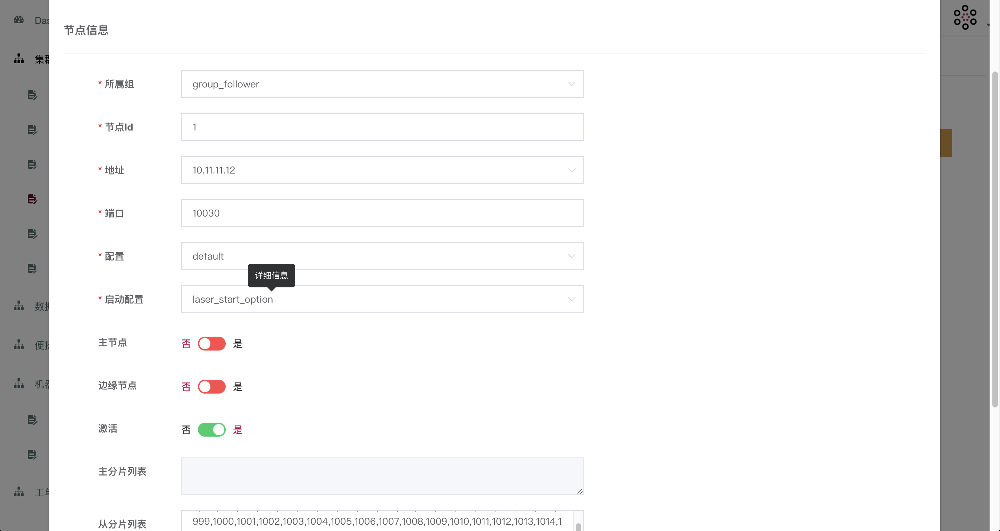


### 集群配置同步

在【集群管理】-【集群管理】中点击【同步】按钮，上传集群配置信息

:::caution 注意
每次增加、修改、删除集群、节点的相关信息或者配置，都要点击 【同步】按钮，才会在 laser 集群生效
:::


### 启动节点

在【集群管理】-【节点管理】中，在节点删点击【更新】按钮，开始部署启动节点：

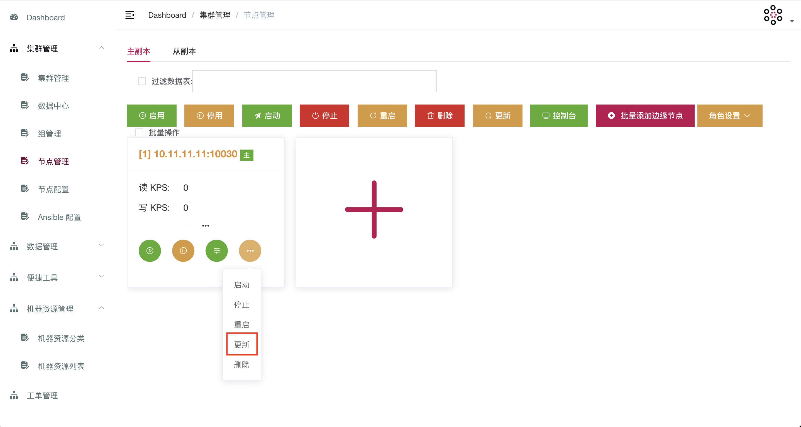


### 表配置

在【数据管理】-【表配置模板】里填入默认的表配置（default），默认配置项如下：

| DbOptions                                        |                         |
| ------------------------------------------------ | ----------------------- |
| 配置项名称                                       | 配置项值                |
| create_if_missing                                | true                    |
| max_background_flushes                           | 20                      |
| max_background_compactions                       | 20                      |
| WAL_ttl_seconds                                  | 3600                    |
| WAL_size_limit_MB                                | 512                     |
| use_direct_reads                                 | true                    |
| compaction_readahead_size                        | 2097152                 |
| **TableOptions**                                 |                         |
| 配置项名称                                       | 配置项值                |
| filter_policy                                    | bloomfilter:10:false    |
| index_type                                       | kTwoLevelIndexSearch    |
| data_block_index_type                            | kDataBlockBinaryAndHash |
| partition_filters                                | true                    |
| metadata_block_size                              | 4096                    |
| cache_index_and_filter_blocks_with_high_priority | true                    |
| cache_index_and_filter_blocks                    | true                    |
| pin_l0_filter_and_index_blocks_in_cache          | true                    |
| block_size                                       | 65536                   |
| **CfOptions**                                    |                         |
| 配置项名称                                       | 配置项值                |
| num_levels                                       | 7                       |


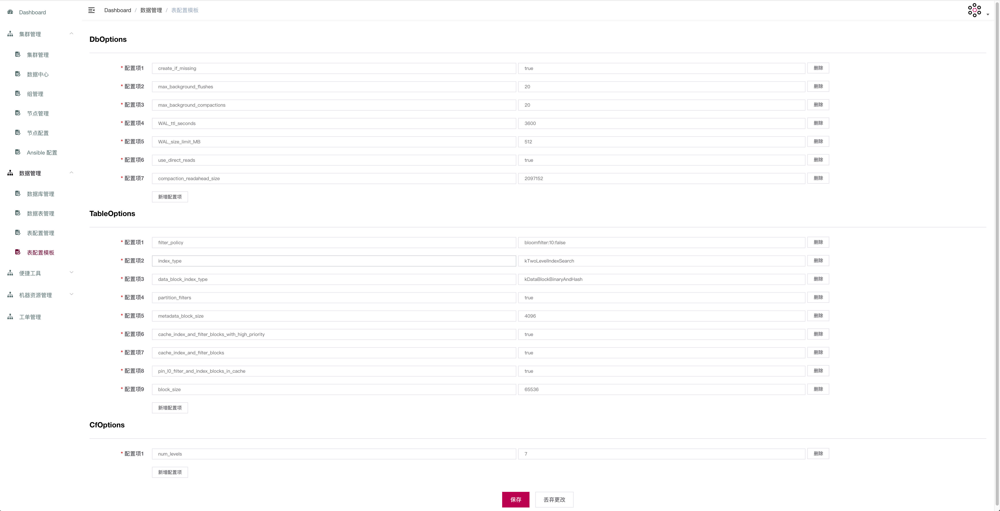

### 创建数据库

在【数据管理】-【数据库管理】中创建一个测试数据库 test:

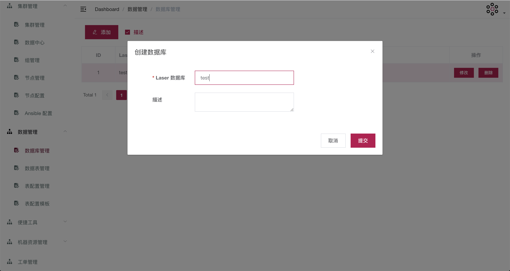


### 创建数据表

在【数据管理】-【数据库管理】中创建一个测试数据表 test:

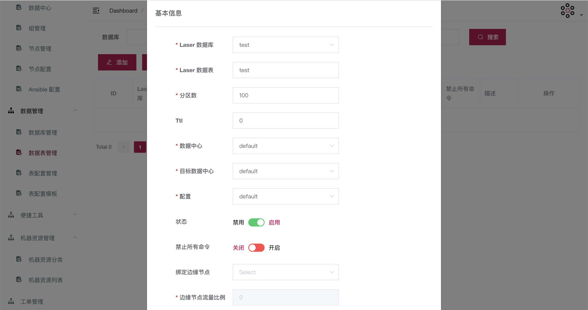


### 同步表信息

在【数据管理】-【数据表管理】中点击【同步】按钮，同步表信息

:::caution 注意
每次增加、修改、删除表的相关信息或者配置，都要点击 【同步】按钮，才会在 laser 集群生效
:::


至此，laser 集群已经部署完成，后续增加节点或者增加表，按上述步骤操作即可。

