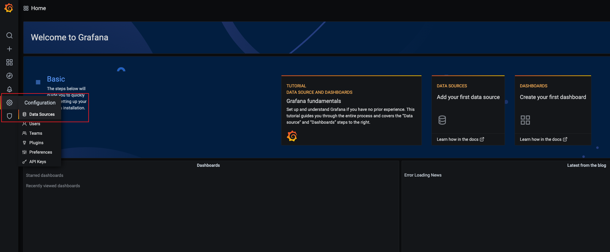
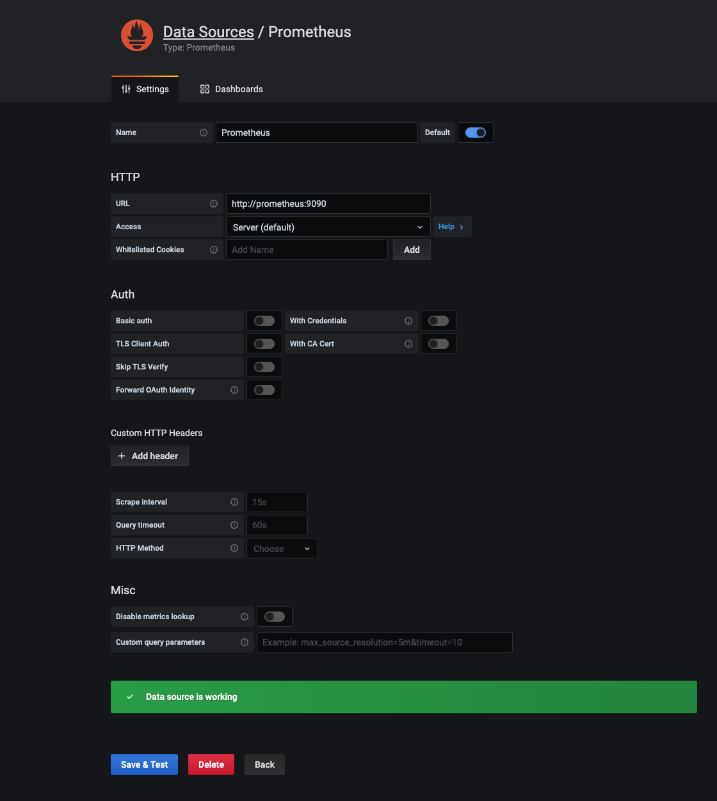

通过阅读本节内容可以快速的体验 LaserDB，通过 Docker Compose 可以快速的创建一个完整的 Laser 测试集群, 方便快速的了解 Laser 的功能特性

:::warning
使用 Docker Compose 方式部署仅适用于开发测试环境，生产部署环境可以使用 Ansible 部署方式
:::

## 环境准备

确保机器上已经安装：

- Docker
- Docker Compose
- Git
- redis-cli

LaserDB 集群默认端口：

:::note
确保本机没有占用如下端口
:::

| 组件          | 默认端口 | 说明                                 |
| :------------ | :------- | :----------------------------------- |
| Consul        | 8500     | Consul server 端口                   |
| Prometheus    | 9090     | Prometheus 服务端口                  |
| Grafana       | 3000     | Grafana 监控面板                     |
| Laser Server  | 10022    | Laser Leader 节点 metrics 上报端口   |
| Laser Server  | 20022    | Laser Leader 节点 thrift 访问端口    |
| Laser Server  | 10023    | Laser Follower 节点 metrics 上报端口 |
| Laser Server  | 20023    | Laser Follower 节点 thrift 访问端口  |
| Laser Proxy   | 10024    | Laser Proxy metrics 上报端口         |
| Laser Proxy   | 16382    | Laser Proxy Redis 协议访问端口       |
| Laser Control | 31000    | Laser Control web 服务端口           |

## 快速安装部署

### 1. 获取代码

```
git clone https://github.com/algo-data-platform/LaserDB.git
```

### 2. 创建并启动集群

```
cd laserdb/docker && docker-compose up -d
```

### 3. 初始化集群配置

启动集群后，我们需要对集群的配置信息进行初始化，将一些 meta data 同步到 laser 集群中。

1. 通过浏览器访问 [http://127.0.0.1:31000](http://127.0.0.1:31000)打开 laser_control 的管理界面
2. 点击左侧导航 `集群管理/集群管理`，点击`同步`按钮同步集群配置信息
3. 点击左侧导航 `数据管理/数据表管理`，点击`同步`按钮同步集群库表配置信息

**说明：** laser_control 的启动依赖 MySQL 的初始化，所以当我们执行完`docker-compose up`命令后，一般需要等待 30 秒左右才能正常打开 laser_control 管理界面

### 4. 使用 Redis Client 访问集群

```
redis-cli -h 127.0.0.1 -p 16382
127.0.0.1:16379> set v0#test_database#test_table#test_key test_value
OK
127.0.0.1:16379> get v0#test_database#test_table#test_key
"test_value"
```

### 5. 使用 Laser Client 访问集群

#### 5.1. 编译测试程序

```bash
bazel build //example:laser_client_test
```

**注意：** 如果没有安装 bazel，可以执行`bash install-bazel.sh`来安装 bazel.

#### 5.2. 运行测试程序

```bash
./bazel-bin/example/laser_client_test \
    --router_consul_addresses=127.0.0.1:8500 \
    --database_name=test_database \
    --table_name=test_table \
    --test_key=test_key \
    --test_value=test_value \
    --rpc_request_timeout=20
```

### 6. 查看集群监控

#### 6.1 进入监控页面

浏览器访问[http://127.0.0.1:3000](http://127.0.0.1:3000)进入 Grafana 登录界面，默认的用户名和密码都是`admin`，初次访问会要求
更改密码，您可以根据需要选择更新密码，或者直接点击`skip`跳过即可。

#### 6.2 配置数据源

点击左侧的`Configuration`按钮，选择`Data Sources`选项进入数据源配置界面。



点击`Add data source`按钮，选择`Prometheus`类型的数据源进入数据源配置表单界面，在`HTTP > URL`选项中填入`http://prometheus:9090`，然后点击底部的`Save & Test`按钮，页面显示`Data source is working`。



#### 6.3 导入监控面板

点击左侧的`Create`按钮，选择`Import`选项，进入面板配置导入界面，点击`Upload JSON file`，选择`laserdb/docker/grafana/laser_server.json`文件，并点击`import`按钮，会自动进入到监控面板。
