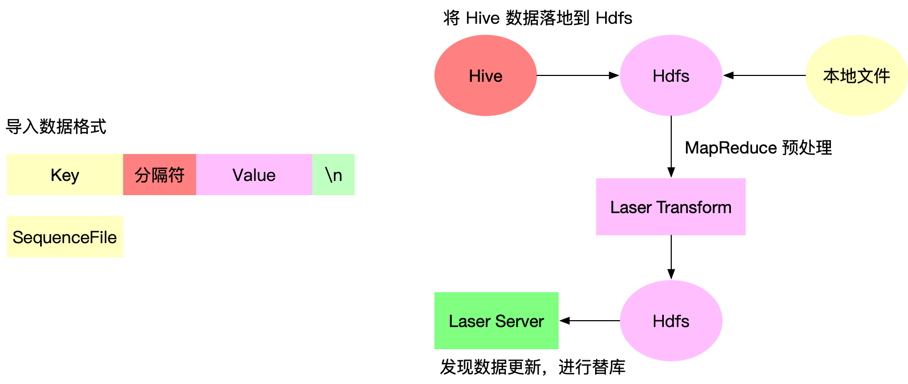

LaserDB 目前除了应用于普通工程当作数据存储介质、Cache 以外，在机器学习中需要使用 LaserDB 存储大规模的特征与模型数据，对于机器学习中的特征和模型数据一般需要离线批量替换、近线批量更新、实时更新三种方式来
更新对应的模型与特征数据。对于一般的离线的特征数据量一般都是 TB 级别的，如果采用传统的 KV 数据库接口来更新无法在例行化周期内完成更新，例如某个1TB 大小的离线特征数据需要每天凌晨更新到线上数据库中，
如果采用接口 set 方式可能在一天内也全量更新不完成。为了解决更新效率问题，Laser 原生支持了两种高效更新数据的方式，分别是全量更新（base）与增量更新：

对于全量更新就是将原始数据通过工具进行格式转化，转化为 Laser Server 直接加载的格式，Laser Server 通过替库的方式来实现数据的全量更新。对于增量更新是 Laser Server 在当前数据库上通过打 patch 的方式来实现增量更新

### 批量导入方式

Laser 目前支持两种类型的数据, 一种是使用分隔符分隔 Key Value 按行组织的 PlainText 的数据，另外一种是 SequenceFile 类型的数据，对于一般的需求使用第一种格式即可，对于 Value 或者 Key 是二进制组成的数据，为了在
导入流程上二进制安全，所以支持了 SequenceFile 格式，具体如何生成 SequenceFile 可以参考 [SequenceFile](https://cwiki.apache.org/confluence/display/HADOOP2/SequenceFile), 
对于数据导入方将原始文件的数据导入到 Laser Server 只需要运行 Laser Transform 这个 MapReduce 即可，MapReduce 指定上对于的数据库、数据表、数据表分区以及数据源路劲即可。当 MapReduce 执行完成后
Laser Server 会自动完成数据的导入。

### 批量导入实现

Laser 批量导入的原理是通过离线的方式先将原始数据转化为一个 Laser Server 可以直接加载的文件，存放到 Hdfs 指定的路劲下，Laser Server 端通过不断的监听 Hdfs 中文件的变化准实时的去拉取加载的文件，当将整个表对应的分区文件都拉取完成后
    
对于全量替库类型的批量导入，Laser Server 会通过拉取到的分区文件创建对应的新的分区 RocksDB 实例，当完全创建完成后将在线服务的 RocksDB 指针切换到新创建的实例上，至此完成一次全量替库操作

对于增量更新类型的批量导入，Laser Server 也会将拉取的到文件创建一个临时的 RocksDB 实例，然后从头到尾的遍历读取数据，最终依次 patch 到当前服务的 RocksDB 实例中去

当通过调用 Laser Transform 这个 MapReduce 后会在 Hdfs 上次如图的目录结构的文件，其中在对应表目录下有一个 METADATA 的文件，该文件主要会记录当前数据表应该批量导入的数据的版本号以及路劲，Laser Server 通过定期获取该文件，
通过和本地数据库 Meta 的 Version 进行对比，如果发生不一致就会触发 Server 端批量导入流程，在此我们引入了数据版本的概念，就是一个数据表会有多个数据版本，可以通过修改 METADATA 中 Version 值快速完成数据的回滚操作，
对于实际应用过程中，比如遇到新生成的数据有问题的情况下，可以通过对应的工具修改 METADATA 文件的版本实现数据的快速回滚

### 性能优化

对于批量导入的整理流程中有将原始文件生成一个 Laser Server 可以直接加载文件的环节，对于 RocksDb 原生支持可以通过将整个数据库 dump 成一个 sst 文件，然后再重新加载的时候可以快速调用 ingest 接口集成进去，但是
对于一个现成的数据库 dump 出 sst 是非常容易高效的，如果将一个原始的文件转化为 sst, 通常我们需要按行读取文件然后调用 RocksDB 的 set 接口将数据写入到 RocksDB 中，最后再调用 dump 接口生成 SST 文件。
对于 KeyValue 对上百亿的数据通过 set 接口写入 RocksDB 中由于原始数据的 Key 是无序的，所以需要 compact 操作，最终生成一个完全对于 Key 有序的 SST. 这个过程是非常耗费 CPU 和内存资源的，并且周期很长。
其实这个流程效率低下的原因就是set 到 RocksDB 中的 key 无序导致的，如果有一种办法在 set 前可以排好序直接按序dump 成 SST 文件就可以解决效率低下的问题，正好对于 MapReduce 每次 Reduce 出来保证每个分区的数据是有序的，
所以 Laser 借助 MapReduce 集群计算资源可以快速的将一个无序的原始数据可以转化为 Laser set 到 RocksDB 的 key 有序的中间文件，所以这也是 Laser Transform 工具存在的原因

