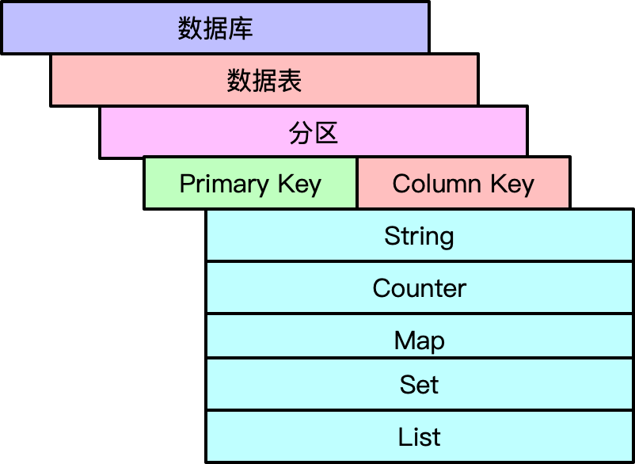
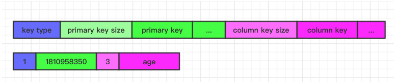
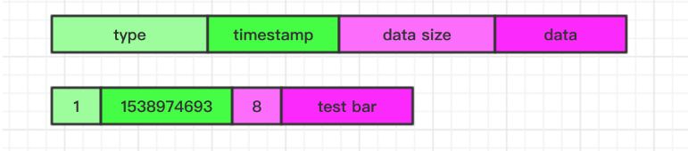
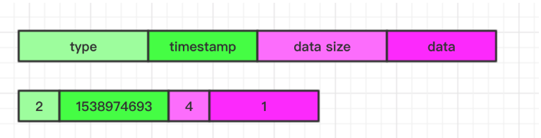
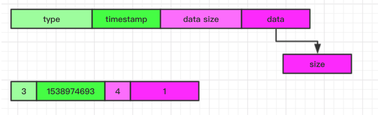
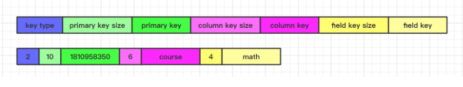
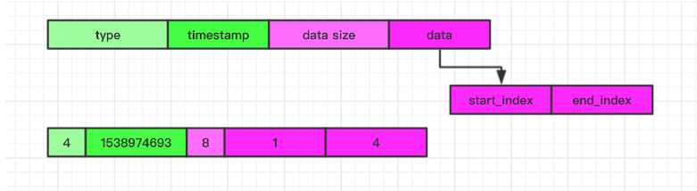
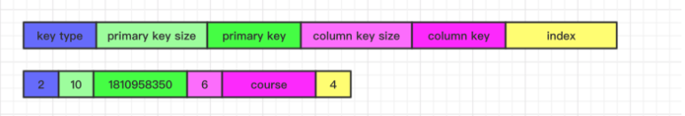
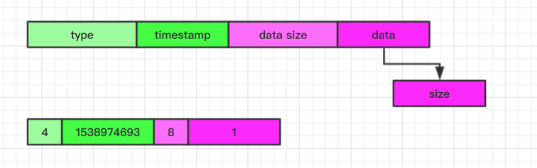
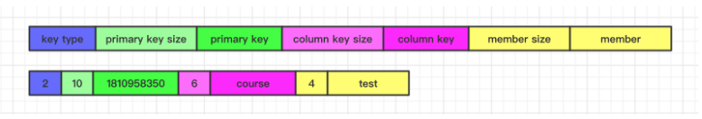

Laser 的数据模型上与 Redis 比较类似，除了支持简单的 String KV 外还支持 Counter、Map、List、Set、Zset 复制的数据类型。Laser 的操作接口也和
Redis 比较接近，不过 Laser 也做了很多补充改进，比如引入多租户的实现、接口返回值扩展
laser 的数据模型层次是 数据库 -> 数据表 -> 数据行 -> (列) ，数据存储类型分别支持 raw-string 、counter、list、set、map，由于基于 rocksdb 开发，所以数据库和rocksdb 中的 db 概念一一对应，数据表、行列通过逻辑映射的方式和 rocksdb 中的 kv 一一映射。
具体的数据模型结构如图：



## 多租户

作为基础数据存储服务上层要对接各种应用场景的数据，如果只是简单的通过 key 空间分割业务，随着接入业务方的增加，不同业务对系统的需求不一样，有的业务 Value 很大但是对延时要求不是很高，
有的业务 Value 不是很大，但对于延时要求极其严格（P999 < 5ms）, 最终很难统一去运维优化系统。如果每个业务一套集群一方面增加运维成本，另一方面对应的物理资源也很难合理的利用起来。
所以 Laser 为了解决不同业务场景不同的需求的从底层就支持了多租户的设计。Laser 同理也引入了数据库、数据表的概念，通过对不同数据库、数据表进行不同的配置来应对不同的业务场景。

## 存储实现

Laser 数据库底层实现使用的存储引擎是 RocksDB, 当然通过实现对应 Interface 的方式可以扩展其他存储引擎。由于 RocksDB 是一个最基本的 KV 存储引擎，Key 和 Value 是支持任何字节流的数据。
Laser 同样也是实现的 KV 存储，不过 Laser 为了在上层实现数据分片、灵活的数据模型没有办法直接使用, 需要基于 Rocksdb 等常用的 KV 存储引擎上进一步的封装。对于 Laser 每个 KV 对同样也是有 Key 和
Value 组成，不过 Value 不是单纯的 String 类型，它有 String、Counter、Map、List、Set、Zset 六种类型，下面是对应Laser Key, 以及六种 Laser Value 的存储实现：

### Laser Key 实现

Laser Key 是由两部分组成一个唯一的 LaserKey, 分别是 PrimaryKey 和 ColumnKey, 两部分的 Key 通过最终的序列化拼接成一个 Key 存储在 RocksDb 中。由于 Laser 是支持分布式水平扩展的，所以就涉及到数据
分片的问题，Laser 数据分片是通过将 Laser Key 的 PrimaryKey 部分进行 hash 最终参与具体的模运算。ColumnKey 是不参与数据分片的。意味着可以保证同一个 PrimaryKey 下的所有 KV 对可以分布在同一个服务节点中。
这对于批量获取某个 PrimaryKey 下的所有的数据来说由于可以很好的利用 BlockCache 可以有效的降低延时。另外对于 List、Set、Map、Zset 需要多个 RocksDB KV 对来模拟一个 Laser 的 KV 对，所以对于一些辅助的
KV 我们通过 Key 空间来分隔，在每个 LaserKey 最前面都有一个字节决定该 Key 的类型，最终 Key 结构如图




### Laser Value 实现

Value 序列化的格式如图：



Laser Value 是支持多种数据类型的，通过一个 data 来存储不同数据类型的数据，具体的每个类型中 data 中的数据格式由具体的类型实现决定，通过 type 来区分具体的不同数据类型。另外一个字段 timestamp 是为了实现 KV 对自动过期而设置的。
该字段会记录当前 KV 对过期的时间点，对于永不过期的 KV 对默认是0，当每次进行查询时都会去校验 timestamp 来确定当前 KV 对是否过期，对于实际过期的 KV 对最终会通过 RocksDB compaction 阶段统一删除

数据类型是通过一个枚举表示：

```
enum class ValueType {
	RAW_STRING = 1,
	COUNTER = 2,
	MAP = 3,
	LIST = 4,
	SET = 5
	ZSET = 6
};
```

最终将枚举序列化为一个 uint8


#### String 类型

对于 String 类型的 Value 最终序列化后的 data 就是原始 String 的数据，最终序列化格式如图：


#### Counter 实现

对于 Counter 类型和 String 的区别是 Value 最终序列化后的 data 是一个 int64，最终序列化格式如图：




#### Map 实现

Laser Map 数据类型的支持与 Redis 基本上一致，同样是一个 key 下面多个 filed, 对于 Redis 来说是直接通过内存来实现对应的数据结构即可，对于 Laser 来说只能在现有的 KV 存储引擎上模拟 Map 的操作行为。
Laser 的 Map 实现是通过额外的辅助 KV 对来完成，为了与我们正常的 Laser Key 在一个 RocksDB 实例中混淆，采用将 LaserKey 前面加前缀的方式来区别不同的 Key 空间。通过加前缀 key type 后将整体 Key 空间
分为正常的 LaserKey 空间与辅助 key 空间。通过正常的 key 关联一个计数器来表示该 map 的元素个数。通过辅助 key 来关联每个元素，并且利用 rocksdb 范围查找的特性来完成 map 的遍历，
通过对于的 Value 记录该 Map 的元素个数，对于 hlen 操作可以直接 get 这个 key 即可获得, 具体的 Value 格式如图



真实的 Map 的元素是通过辅助 Key 的方式记录，实现的方式就是在原来 LaserKey 后增加对应的 field name 即可, 具体的 Key 格式如图



#### List 实现

对于 List 设计的思路和 Map 类似都是借助于辅助的 Key 来保存具体的数据。队列通过一个 start index 和 end index 来模拟一个队列操作，比如从最前面消费一个数据 start + 1, 插入一个数据 start - 1, 
从后面消费一个数据 end - 1, 插入一个数据 end + 1, 具体插入的数据是通过当前的 index 和 laserKey 组成的辅助 Key 来关联保存，每次 Pop, Push 操作都会更新 start, end index.

start index 和 end index 保存的格式如下：



最终用来保存队列的元素的辅助 Key 的格式如下:



#### Set 实现

Set 最主要的特性是保证一个 key 下的 member 的唯一性，所以 Laser 在 Set 实现上是借助于 RocksDb Key 来保证 member 的唯一性，所以在 LaserKey 对应关联的 Value 中保存 Set 的 member 的个数，
通过辅助 Key 来保存 member 具体的值

对应的 Value 格式如下：



辅助 Key 格式如下：



由于 Laser Set 是最终借助于 RocksDB Key 来实现唯一性的，所以有一个限制就是 member 的值不能过长，辅助可能会影响性能

#### ZSet 实现

ZSet 是有序的集合，虽然调用接口与 Redis 相似，但是具体实现与 Redis 的稍有不同，对于 Redis 是通过 key 与 member 表示唯一的，score 只是作为排序的因子。但是 Laser 实现的 ZSet 是采用 key 与 score
表示唯一性的，顺便使用 score 作为排序因子，这就意味着对于 Laser 的 Zset 是不允许修改 score 值的

具体的实现与 set 类似都是通过 Value 来保存 set 集合的 member 个数：


通过辅助 Key 来记录 member 值


最终 Laser 是借助于 RocksDb 前缀相同有序的方式来实现了 Zset 的member 的有序。另外此处需要保证序列化 score 值的时候采用 大端的方式序列化，这样才能保证最终 rocksDB 二进制比较与 score 值比较结果一致


